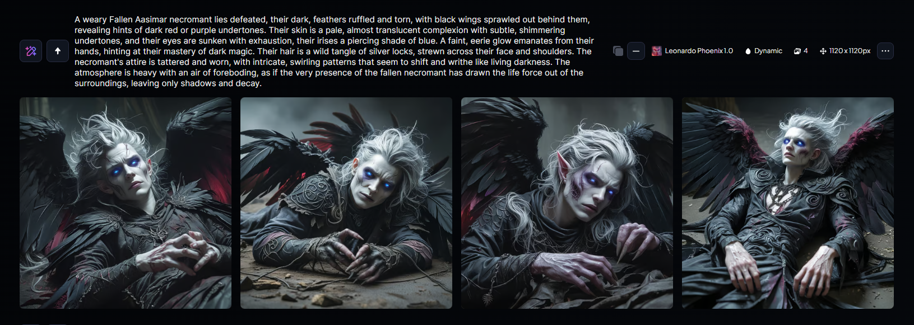
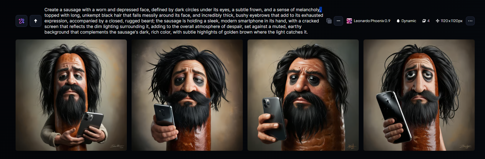

# Projeto de IA Generativa

Este projeto é voltado para o uso de ferramentas de IA generativa, incluindo o Copilot, ChatGPT e Leonardo.IA. Ele explora como essas ferramentas podem ser aplicadas para criar conteúdo gerado automaticamente, como código, imagens e outras saídas criativas.

## Estrutura do Projeto

A estrutura do projeto é organizada da seguinte forma:

## Descrição do Processo de Uso das Ferramentas

### ChatGPT e Copilot

1. **Uso:** O ChatGPT pode ser usado para gerar conteúdo textual ou fornecer ajuda em tarefas como explicações, sugestões de código, entre outros.
2. **Processo:**
   - Acesse a interface do ChatGPT em seu navegador ou por meio de uma API.
   - Forneça instruções claras sobre o que deseja gerar (por exemplo, uma descrição, código, etc.).
   - O ChatGPT responderá com sugestões ou exemplos que podem ser facilmente adaptados.

### Leonardo.IA

Leonardo.IA é uma ferramenta para gerar imagens criativas a partir de descrições textuais, com foco em arte digital e ilustração.

1. **Uso:** 
   - Acesse a plataforma Leonardo.IA.
   - Insira uma descrição detalhada do que você deseja gerar (por exemplo, uma cena cósmica ou uma paisagem futurista).
   - A ferramenta irá gerar uma imagem baseada na descrição fornecida.

2. **Exemplo de uso que fiz utilizando o leonardo.IA (prints de Leonardo.IA):**
   
   Aqui foi a criação de um personagem para uso de jogos RPG, quanto mais detalhista for, melhor vai ficar!
   
   
   Aqui foi uma brincadeira com um amigo meu que sempre comia linguiça no almoço durante 2 anos no trabalho, e ele tem cabelo longo e olhos cansados
   

## Conclusão

Utilizo IA's diariamente, principalmente o chat GPT, é meu novo "google", inclusive esse read.me foi feito com auxílio dele.

Este repositório demonstra como diferentes ferramentas de IA generativa podem ser usadas em conjunto para criar uma variedade de saídas criativas, desde código até imagens digitais impressionantes. A integração dessas ferramentas pode potencializar a produtividade e expandir os limites da criação digital.
